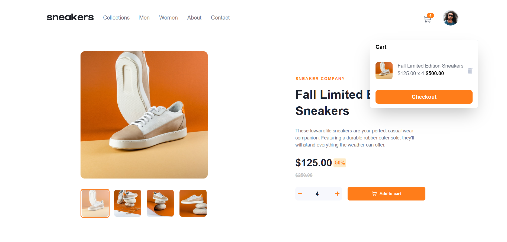

# Frontend Mentor - E-commerce product page solution

This is a solution to the [E-commerce product page challenge on Frontend Mentor](https://www.frontendmentor.io/challenges/ecommerce-product-page-UPsZ9MJp6). Frontend Mentor challenges help you improve your coding skills by building realistic projects.

## Table of contents

- [Overview](#overview)
  - [The challenge](#the-challenge)
  - [Screenshot](#screenshot)
  - [Links](#links)
- [My process](#my-process)
  - [Built with](#built-with)
  - [Continued development](#continued-development)
- [Author](#author)

## Overview

This E-commerce Product Page is built by ReactJS, React Hooks and ChakraUI. The items in the Cart are stored using Local Storage. In the mobile version, you can swipe between the product images.

### The challenge

Users should be able to:

- View the optimal layout for the site depending on their device's screen size
- See hover states for all interactive elements on the page
- Open a lightbox gallery by clicking on the large product image
- Switch the large product image by clicking on the small thumbnail images
- Add items to the cart
- View the cart and remove items from it

### Screenshot

### Links

- Solution URL: (https://github.com/sedcakmak/E-commerce-Product-Page)
- Live Site URL: (https://ecommerce-productpage-main.netlify.app/)

### Built with

- [React](https://reactjs.org/) - JS library
- React Hooks (useState, useEffect, useContext)
- [Chakra UI](https://chakra-ui.com/) - For styles

### Continued development

This is my first time using Chakra UI and I did my best not to use regular CSS, however I've realized that limited the styling on several UIs.

## Author

- Frontend Mentor - [@sedcakmak](https://www.frontendmentor.io/profile/sedcakmak)
- GitHub - [@sedcakmak](https://github.com/sedcakmak)
